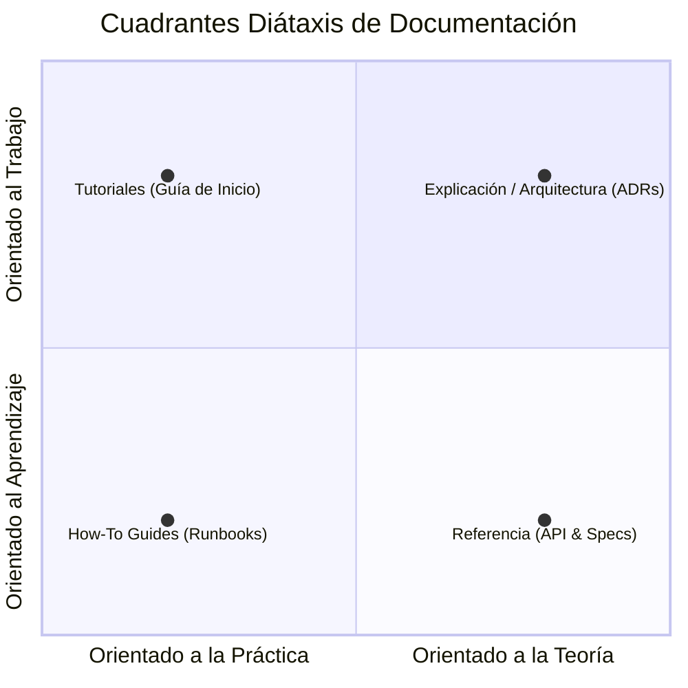

# Centro de Documentación Enterprise — Portfolio Tumidev

Bienvenido al centro de documentación oficial del proyecto. Esta documentación está organizada según el **Framework Diátaxis**, un estándar Enterprise para la arquitectura de información técnica estructurada en 4 cuadrantes.

---

##  Arquitectura Diátaxis de la Documentación

---

## 📚 Mapa General de Documentación

### 1. Tutoriales (Tutorials — Aprendizaje)
* [README.md Principal](file:///C:/Users/HACKTU/code/portfolio/README.md): Resumen ejecutivo, stack tecnológico y Quick Start.
* [Guía de Contribución](file:///C:/Users/HACKTU/code/portfolio/CONTRIBUTING.md): Guía de incorporación para desarrolladores, flujo de Git y normas de PR.

### 2. Guías de Procedimiento (How-To Guides — Tareas Prácticas)
* [Runbook de Desarrollo Local](file:///C:/Users/HACKTU/code/portfolio/docs/guides/LOCAL_DEVELOPMENT_RUNBOOK.md): Guía para coexistencia en Windows, WSL2, Docker y pnpm.
* [Runbook de Despliegue y CI/CD](file:///C:/Users/HACKTU/code/portfolio/docs/guides/DEPLOYMENT_RUNBOOK.md): Procedimiento de despliegue en Vercel y pipelines de validación.

### 3. Referencia Técnica (Reference — Información Explicita)
* [Especificación del API de Contacto](file:///C:/Users/HACKTU/code/portfolio/docs/api/CONTACT_API_SPEC.md): Especificación del contrato OpenAPI 3.1 para `/api/contact`.
* [Política de Seguridad](file:///C:/Users/HACKTU/code/portfolio/SECURITY.md): Especificaciones de CSP, HSTS, Sanitización Zod/DOMPurify y Rate Limiting.
* [Orquestador AI y Reglas de Desarrollo](file:///C:/Users/HACKTU/code/portfolio/AGENTS.md): Especificación para agentes de IA y comandos del sistema (`.opencode/`).

### 4. Explicación y Decisiones (Explanation / Architecture — Entendimiento)
* [Arquitectura del Sistema](file:///C:/Users/HACKTU/code/portfolio/docs/architecture/ARCHITECTURE.md): Diagrama C4, capas de componentes y flujo de datos.
* [Registros de Decisiones de Arquitectura (ADRs)](file:///C:/Users/HACKTU/code/portfolio/docs/adr/):
  * [ADR 0001: Next.js 16 App Router & Turbopack](file:///C:/Users/HACKTU/code/portfolio/docs/adr/0001-nextjs-app-router-turbopack.md)
  * [ADR 0002: Sistema de Colores Progresivo y Tailwind CSS v4](file:///C:/Users/HACKTU/code/portfolio/docs/adr/0002-tailwind-v4-color-system.md)
  * [ADR 0003: Migración al Gestor de Paquetes pnpm v11](file:///C:/Users/HACKTU/code/portfolio/docs/adr/0003-pnpm-package-manager.md)
  * [ADR 0004: Suite de Accesibilidad WCAG 2.1 de 4 Cuadrantes](file:///C:/Users/HACKTU/code/portfolio/docs/adr/0004-accessibility-wcag-system.md)
  * [ADR 0005: Estrategia de Actualización de Dependencias Major/Patch](file:///C:/Users/HACKTU/code/portfolio/docs/adr/0005-dependency-update-strategy.md)
* [Investigación de Accesibilidad de Color](file:///C:/Users/HACKTU/code/portfolio/docs/research/RESEARCH_COLOR_SYSTEM.md): Análisis de ratios de contraste WCAG 2.1.
* [Historial de Mejoras](file:///C:/Users/HACKTU/code/portfolio/docs/history/HISTORIAL_MEJORAS.md): Bitácora histórica de iteraciones y auditorías.
