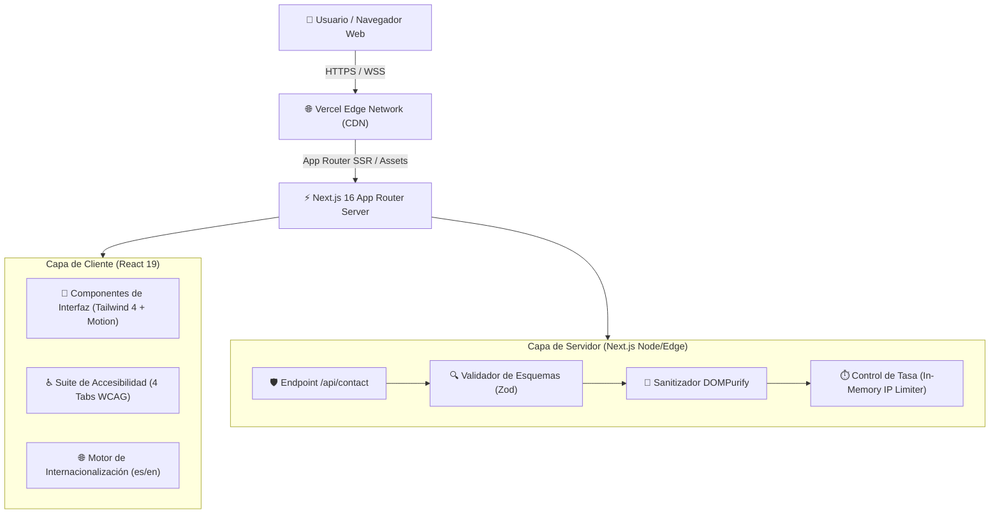

# Arquitectura del Sistema (System Architecture Overview)

Este documento describe la arquitectura técnica, los componentes y los patrones de diseño aplicados en **Portfolio Tumidev**, alineados con las prácticas Enterprise de 2026.

---

## 1. Visión General del Sistema (C4 Model - Nivel 2: Contenedores)

---

## 2. Principios de Arquitectura

1. **Strict Modular Boundaries:** Los componentes UI no realizan mutaciones globales directas. El estado compartido se maneja a través de Contexts (`AccessibilityContext`, `I18nContext`).
2. **Progressive Enhancement:** El sitio entrega contenido accesible estático y eleva progresivamente animaciones complejas (Framer Motion) y capacidades interactivas.
3. **Defense in Depth (Seguridad en Capas):**
   * Validación formal de tipo en tiempo de compilación con TypeScript strict mode.
   * Validación formal en tiempo de ejecución con Zod schemas.
   * Sanitización activa contra vectores XSS con DOMPurify.
   * Encabezados de seguridad HTTP estrictos (CSP, HSTS, X-Frame-Options).

---

## 3. Estructura de Capas de Código (`src/`)

* **`src/app/`**: Definición de rutas (Next.js App Router), API endpoints, metadatos, `layout.tsx`, `sitemap.ts`, `robots.ts`.
* **`src/components/`**:
  * `common/`: Componentes UI atómicos y reutilizables (Botones, Selectores, Typographies).
  * `sections/`: Secciones de la página principal (Hero, About, Experience, Skills, Projects, Contact).
  * `accessibility-tabs/`: Componentes especializados para la suite WCAG 2.1.
* **`src/contexts/`**: Proveedores de estado global para accesibilidad e internacionalización.
* **`src/hooks/`**: Custom hooks encapsulando comportamiento del cliente y efectos secundarios (probados unitariamente con Jest).
* **`src/lib/`**: Utilidades puras, constantes del sistema y sanitizadores.
* **`src/types/`**: Contratos de datos TypeScript unificados.
